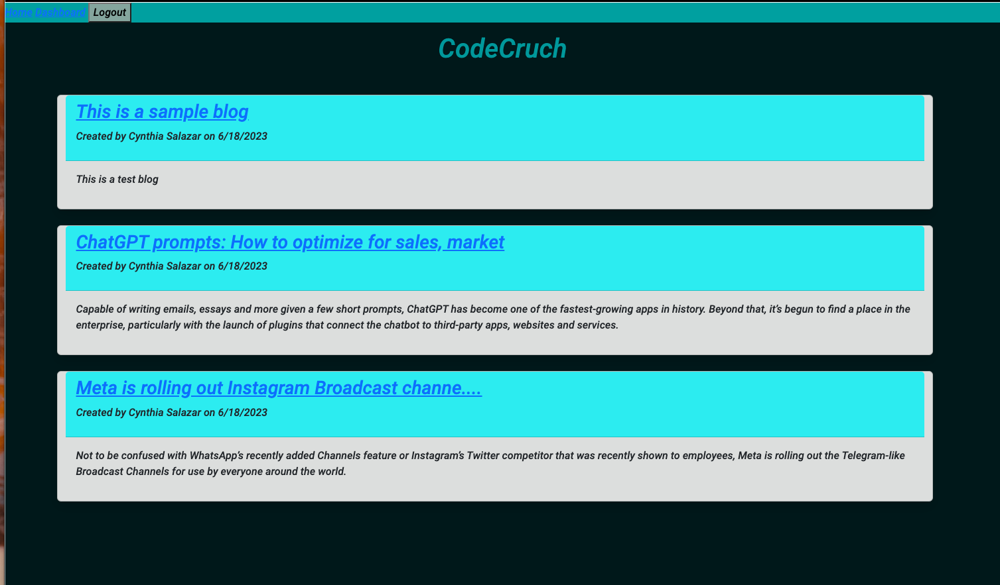
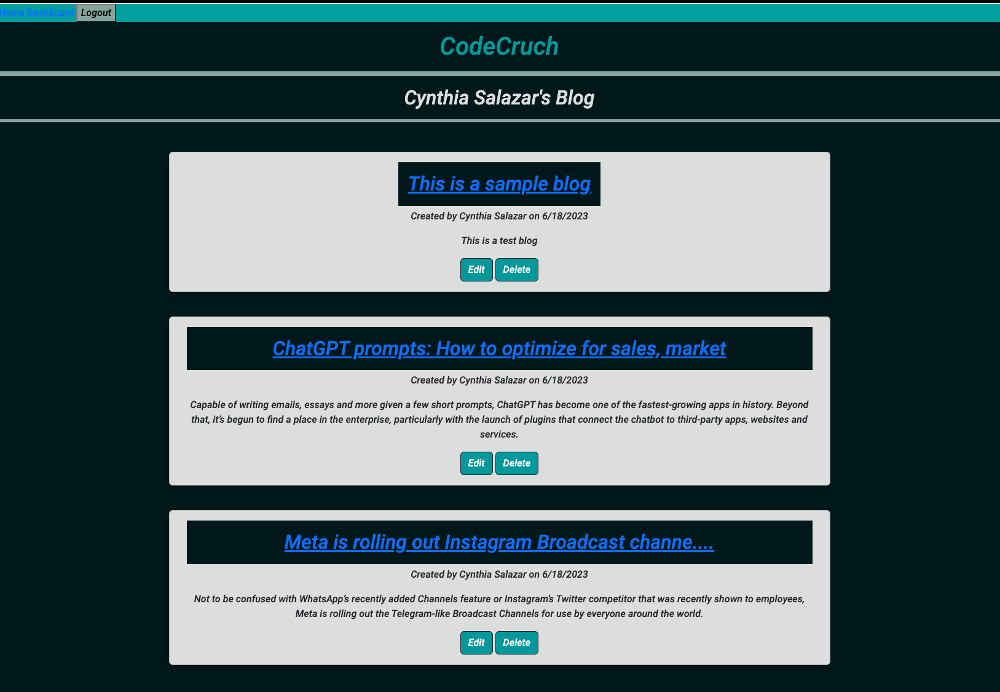
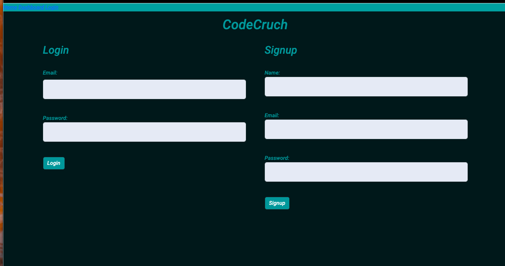

# CodeCrunch
A CMS-style blog site similar to a Wordpress site, where developers can publish their blog posts and comment on other developers’ posts as well.

## Table of Contents

- [Description](#description)
- [User Story](#user-story)
- [Acceptance Criteria](#acceptance-criteria)
- [Preview Images](#preview-images) 
- [Link To Walkthru Video](#link-to-walkthru-video)
- [Installation and Usage](#installation-and-usage)
- [Tests](#tests)
- [Technologies Used](#technologies-used)
- [Credits](#credits)
- [License](#license)

## Descriptiom

A CMS-style blog site similar to a Wordpress site, where developers can publish their blog posts and comment on other developers’ posts as well.

Writing about tech can be just as important as making it. Developers spend plenty of time creating new applications and debugging existing codebases, but most developers also spend at least some of their time reading and writing about technical concepts, recent advancements, and new technologies. A simple Google search for any concept covered in this course returns thousands of think pieces and tutorials from developers of all skill levels!

## User Story

```md
AS A developer who writes about tech
I WANT a CMS-style blog site
SO THAT I can publish articles, blog posts, and my thoughts and opinions
```

## Acceptance Criteria

```md
GIVEN a CMS-style blog site
WHEN I visit the site for the first time
THEN I am presented with the homepage, which includes existing blog posts if any have been posted; navigation links for the homepage and the dashboard; and the option to log in
WHEN I click on the homepage option
THEN I am taken to the homepage
WHEN I click on any other links in the navigation
THEN I am prompted to either sign up or sign in
WHEN I choose to sign up
THEN I am prompted to create a username and password
WHEN I click on the sign-up button
THEN my user credentials are saved and I am logged into the site
WHEN I revisit the site at a later time and choose to sign in
THEN I am prompted to enter my username and password
WHEN I am signed in to the site
THEN I see navigation links for the homepage, the dashboard, and the option to log out
WHEN I click on the homepage option in the navigation
THEN I am taken to the homepage and presented with existing blog posts that include the post title and the date created
WHEN I click on an existing blog post
THEN I am presented with the post title, contents, post creator’s username, and date created for that post and have the option to leave a comment
WHEN I enter a comment and click on the submit button while signed in
THEN the comment is saved and the post is updated to display the comment, the comment creator’s username, and the date created
WHEN I click on the dashboard option in the navigation
THEN I am taken to the dashboard and presented with any blog posts I have already created and the option to add a new blog post
WHEN I click on the button to add a new blog post
THEN I am prompted to enter both a title and contents for my blog post
WHEN I click on the button to create a new blog post
THEN the title and contents of my post are saved and I am taken back to an updated dashboard with my new blog post
WHEN I click on one of my existing posts in the dashboard
THEN I am able to delete or update my post and taken back to an updated dashboard
WHEN I click on the logout option in the navigation
THEN I am signed out of the site
WHEN I am idle on the site for more than a set time
THEN I am able to view posts and comments but I am prompted to log in again before I can add, update, or delete posts
```

## Preview Images
- ## Preview - Home

- ## Preview - Dashboard 

- ## Preview - Login 



## Link To Walkthru Video
**Walkthrough Video:** [Link To Walkthru Video](https://youtu.be/N3OneFKybxs) 


## Installation and Usage
- To clone the repo: https://github.com/cynthiamory/E-commerce-Got-Back.git
- Install [Node](https://nodejs.org/en). version 16 and up. Command line: npm init 
- Install [Sequelize](https://www.npmjs.com/package/sequelize). version 16 and up. Command line: npm i sequelize 
- Install Express: [Version 4.17.1](https://www.npmjs.com/package/express) Command line: npm i express@4.17.1
- Then install MySQL2: [Version 3.1.2](https://www.npmjs.com/package/mysql2) Command line: npm i mysql2
- Install nodemon: [Version 2/0/22](https://www.npmjs.com/package/nodemon) Command line: npm i nodemon
- dotenv: [dotenv 16.1.4](https://www.npmjs.com/package/dotenv) Command line: npm install dotenv --save
- dotenv: [Boottrap](https://www.npmjs.com/package/bootstrap) Command line: npm i bootstrap
- Run the application using Command: 
```bash
node server.js
```
```bash
npm start
```

- Add your .env file in the root directory of the repo. Here you will pass your database name, your mySQl user and password. This will need to be done before running the app to allow a the connection.js to use the enviromental variables and keep your credentials protected.
- Create your database. Navigate to the db Directory which holds the schema.sql file. Then you will need to open the MySQL Shell by running the command line: 
```bash
mysql -u root -p 
```
in your terminal. When prompted, enter your password.
- Now, run your schema.sql file to create the database by using the command: 
```bash
SOURCE Schema.sql
```
- Now you will need to seed your database. Navigate your your root directory and use the command:
```bash
npm run seed.
```
- Once completed, you may now run the command: 
```bash
npm start
```
to initiate the server.
- Now you can leverage Insomnia to test the functionality of the routes in the application.


## Tests
- There are no tests yet for this application

## Technologies Used
Assignment was built with:


## Credits
- CodeCrunch: Cynthia Morales - Full Stack Developer Student
- Institution: The University Of Toronto
- Course: Bootcamp Full Stack Development
- Instructor: Ali Masqood
- Tutor: Jose Lopez 
- Learing Assistant Ask BCS Support: Ntando (nmendu)
- Online Support: W3Schools, Youtube, SQL Shack, mySQL, Stack Overflow, Sequelize.org
- License badges: Sheilds.io


## License

